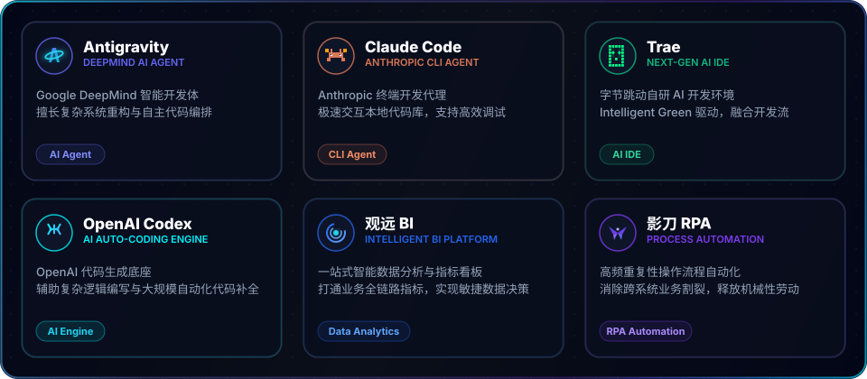
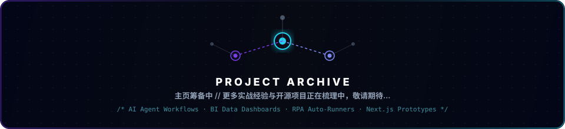

<div align="center">

  

  <a href="https://github.com/usertianziyang">
    
  </a>

  <br />
  <br />

  
  
  

</div>

---

<div align="center">

  

</div>

## 🚀 关于我 | About Me

> **"结合 AI 智能体与自动化流程，让重复工作归零，数据洞察落地。"**

```ts
const leo = {
  role: "AI 工作流构建者 / AI 编程实践者 / 数据与自动化专家",
  tools: ["Antigravity", "Claude Code", "Trae", "Codex", "观远 BI", "影刀 RPA"],
  languages: ["TypeScript", "JavaScript", "Python", "SQL"],
  frontend: ["React", "Vue", "Next.js", "科技风页面", "数据可视化"],
  direction: "整合 AI 代理、智能 IDE、BI 数据分析与 RPA 自动化，构建极致高效的数字化工作流",
};
```

我擅长将模糊的需求转化为可自动运行的生产力闭环：使用 **Antigravity** & **Claude Code** 自主规划编排代码，**Trae** & **Codex** 进行高效开发与迭代，**观远 BI** 进行数据多维建模与呈现，**影刀 RPA** 自动化跨系统的繁琐日常，最后通过**全栈前端页面**将所有业务流具象化展示。

---

## ⚡ 能力矩阵 | Competence Matrix

<table>
  <tr>
    <td width="50%">
      <h3>🤖 AI 智能代理与 Agentic 编程</h3>
      <p>深度应用 <b>Antigravity</b> 与 <b>Claude Code</b>，构建自主规划、代码自动编写与全栈系统调试的闭环。</p>
    </td>
    <td width="50%">
      <h3>🛠️ 智能 IDE 与开发加速</h3>
      <p>利用 <b>Trae</b> 与 <b>Codex</b> 进行快速原型开发、智能代码预测与重构，极大缩短需求到上线的链路。</p>
    </td>
  </tr>
  <tr>
    <td width="50%">
      <h3>📊 观远 BI 与数据洞察</h3>
      <p>聚焦企业数据看护，基于<b>观远 BI</b> 打造多维动态看板、商业指标建模，让隐性数据转化为显性决策依据。</p>
    </td>
    <td width="50%">
      <h3>⚙️ 影刀 RPA 与流程自动化</h3>
      <p>编写自动化机器人，打通跨平台数据壁垒，实现无干预的报表爬取、数据对账与高频重复动作流。</p>
    </td>
  </tr>
  <tr>
    <td width="50%">
      <h3>🎨 现代前端与视觉表达</h3>
      <p>偏好霓虹高对比、科技深色风与数据可视化大屏，熟练运用 React、Vue、Next.js 实现流畅且高级的视觉交互。</p>
    </td>
    <td width="50%">
      <h3>🪐 工具链与效率工程</h3>
      <p>擅长将 CLI 工具、API 编排、自动化脚本与低代码系统打造成可扩展、高复用的个人级生产力基础设施。</p>
    </td>
  </tr>
</table>

---

## 🛠️ 我的数字化工作台 | Tool Stack

<div align="center">
  
</div>

## 💻 技术语言与专业栈 | Tech Stack

<div align="center">
  
</div>

---

## 📁 项目经验 | Project Showcase

> **极致工作流的落地实践。项目成果正在整理与脱敏中...**

<div align="center">
  
</div>

---

## 📊 3D 贡献卡 | 3D Contribution Card

<div align="center">

  

</div>

## 📈 数据面板 | GitHub Stats

<div align="center">

  

  <br />
  <br />

  
  

  <br />
  <br />

  

</div>

## 🕸️ 贡献轨迹 | Contribution Graph

<div align="center">

  

  <br />

  <picture>
    <source media="(prefers-color-scheme: dark)" srcset="https://raw.githubusercontent.com/usertianziyang/usertianziyang/output/github-contribution-grid-snake-dark.svg" />
    <source media="(prefers-color-scheme: light)" srcset="https://raw.githubusercontent.com/usertianziyang/usertianziyang/output/github-contribution-grid-snake.svg" />
    
  </picture>

</div>

> 💡 *3D 贡献卡由 `.github/workflows/profile-3d.yml` 自动生成，蛇形动画由 `.github/workflows/snake.yml` 自动生成。*

## 🔗 快速入口 | Navigation

<div align="center">

  <a href="https://github.com/usertianziyang">
    
  </a>
  <a href="https://github.com/usertianziyang?tab=repositories">
    
  </a>
  <a href="https://github.com/usertianziyang?tab=followers">
    
  </a>

</div>

---

<div align="center">

  

</div>
