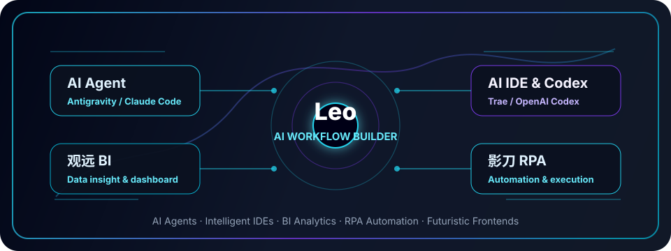
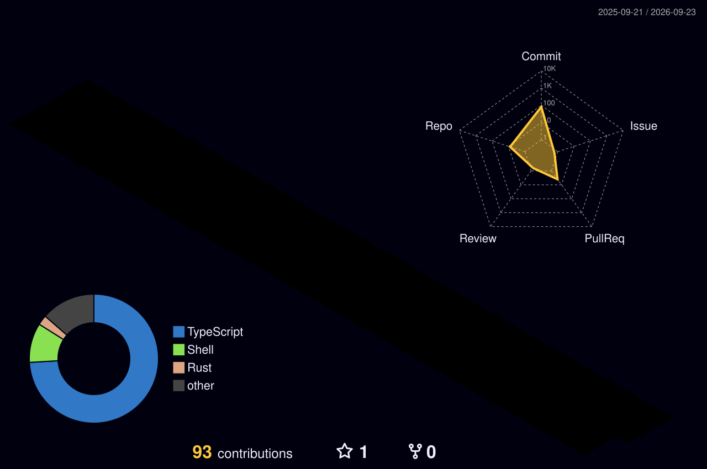

<div align="center">

  

  <a href="https://github.com/usertianziyang">
    
  </a>

  <br />
  <br />

  
  
  

</div>

---

<div align="center">

  

</div>

## 我的定位

> 让想法快速成型，让流程自动运转，让页面带一点未来感。

```ts
const leo = {
  role: "Vibecoding 实践者 / AI 工作流搭建者 / 全栈开发者",
  tools: ["Codex", "Claude Code", "观远 BI", "影刀 RPA"],
  languages: ["TypeScript", "JavaScript", "Python", "SQL"],
  frontend: ["React", "Vue", "Next.js", "科技风页面", "数据可视化"],
  direction: "把 AI 编程、BI 分析、RPA 自动化和前端展示串成完整闭环",
};
```

我比较擅长把一个模糊需求拆成可执行的流程：先用 AI 工具加速设计和编码，再用 BI 看清数据，用 RPA 处理重复动作，最后通过前端页面把结果展示出来。  
对我来说，代码不是孤立的文件，而是连接业务、数据、自动化和体验的工作流。

## 能力矩阵

<table>
  <tr>
    <td width="50%">
      <h3>AI 编程与 Vibecoding</h3>
      <p>使用 Codex、Claude Code 等工具进行需求拆解、代码生成、调试修复和快速原型搭建。</p>
    </td>
    <td width="50%">
      <h3>编程语言与工程实现</h3>
      <p>常用 TypeScript、JavaScript、Python、SQL，关注结构清晰、可维护和可持续迭代。</p>
    </td>
  </tr>
  <tr>
    <td width="50%">
      <h3>观远 BI 与数据分析</h3>
      <p>围绕指标、看板、数据集和业务分析场景，把数据转成可理解、可追踪的决策信息。</p>
    </td>
    <td width="50%">
      <h3>影刀 RPA 与自动化流程</h3>
      <p>把高频、重复、规则明确的操作流程自动化，减少机械劳动，提升执行稳定性。</p>
    </td>
  </tr>
  <tr>
    <td width="50%">
      <h3>前端页面与视觉表达</h3>
      <p>偏好深色科技风、霓虹高对比、数据看板、玻璃拟态和有节奏的动效表达。</p>
    </td>
    <td width="50%">
      <h3>工具链与效率系统</h3>
      <p>喜欢把脚手架、自动化脚本、AI Agent 和低代码工具组合成可复用的生产力系统。</p>
    </td>
  </tr>
</table>

## 技术与工具

<div align="center">

  
  
  
  
  

  <br />
  <br />

  

</div>

## 展示内容建议

<table>
  <tr>
    <td width="33%">
      <h3 align="center">科技风封面图</h3>
      <p align="center">用于呈现个人定位和工具栈，适合放在主页第一屏。</p>
    </td>
    <td width="33%">
      <h3 align="center">项目截图</h3>
      <p align="center">展示前端页面、BI 看板、RPA 流程结果，比纯文字更有说服力。</p>
    </td>
    <td width="33%">
      <h3 align="center">流程架构图</h3>
      <p align="center">把 AI 编程、数据分析、自动化执行和页面展示串成一张图。</p>
    </td>
  </tr>
</table>

## 3D 贡献卡

<div align="center">

  

</div>

## 数据面板

<div align="center">

  

  <br />
  <br />

  
  

  <br />
  <br />

  

</div>

## 贡献轨迹

<div align="center">

  

  <br />

  <picture>
    <source media="(prefers-color-scheme: dark)" srcset="https://raw.githubusercontent.com/usertianziyang/usertianziyang/output/github-contribution-grid-snake-dark.svg" />
    <source media="(prefers-color-scheme: light)" srcset="https://raw.githubusercontent.com/usertianziyang/usertianziyang/output/github-contribution-grid-snake.svg" />
    
  </picture>

</div>

> 3D 贡献卡由 `.github/workflows/profile-3d.yml` 自动生成，蛇形动画由 `.github/workflows/snake.yml` 自动生成。

## 快速入口

<div align="center">

  <a href="https://github.com/usertianziyang">
    
  </a>
  <a href="https://github.com/usertianziyang?tab=repositories">
    
  </a>
  <a href="https://github.com/usertianziyang?tab=followers">
    
  </a>

</div>

---

<div align="center">

  

</div>
