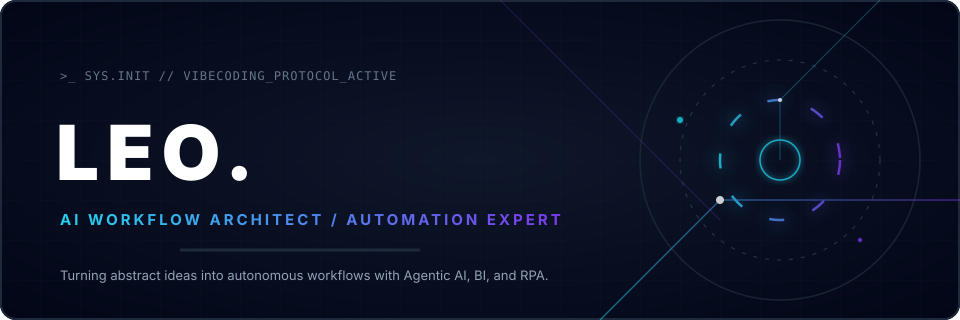

<div align="center">
  
</div>

<br />

> **"结合 AI 智能体与自动化流程，让重复工作归零，数据洞察落地。"**

<br />

```ts
const leo = {
  role: "AI Workflow Architect / Automation Expert",
  tools: ["Antigravity", "Claude Code", "Trae", "Codex", "观远 BI", "影刀 RPA"],
  languages: ["TypeScript", "Python", "SQL", "React", "Next.js"],
  philosophy: "整合 AI 代理、智能 IDE 与自动化引擎，构建极致高效的数字化工作流",
};
```

<br />

## ⚡ 核心能力 | Core Competence

> **🤖 AI 智能代理与 Agentic 编程**
> 
> 深度应用 **Antigravity** 与 **Claude Code**，构建自主规划、代码自动编写与系统调试的闭环。

> **🛠️ 智能 IDE 与极速开发**
> 
> 利用 **Trae** 与 **Codex** 进行快速原型开发、智能预测与重构，缩短需求到上线的链路。

> **📊 观远 BI 与商业数据洞察**
> 
> 聚焦指标监控与看护，基于 **观远 BI** 打造动态看板，让隐性数据转化为显性决策依据。

> **⚙️ 影刀 RPA 与流程自动化**
> 
> 编写自动化机器人，打通跨系统数据壁垒，实现无干预的报表提取与高频重复动作流。

<br />

## 🛠️ 工具引擎 | Workflow Engines

<div align="center">
  
</div>

<br />

## 📁 项目档案 | Project Archive

<div align="center">
  
</div>

<br />

## 🕸️ 活跃轨迹 | Activity

<div align="center">
  <picture>
    <source media="(prefers-color-scheme: dark)" srcset="https://raw.githubusercontent.com/usertianziyang/usertianziyang/output/github-contribution-grid-snake-dark.svg" />
    <source media="(prefers-color-scheme: light)" srcset="https://raw.githubusercontent.com/usertianziyang/usertianziyang/output/github-contribution-grid-snake.svg" />
    
  </picture>
</div>
